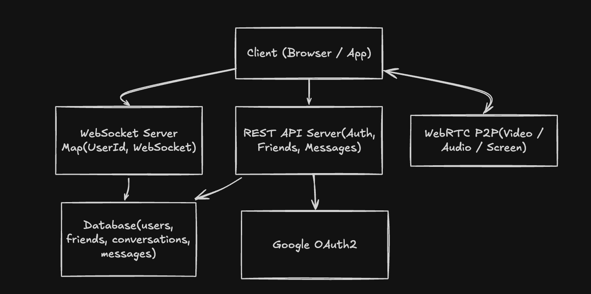
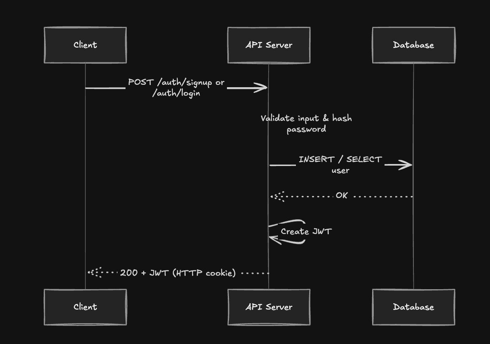
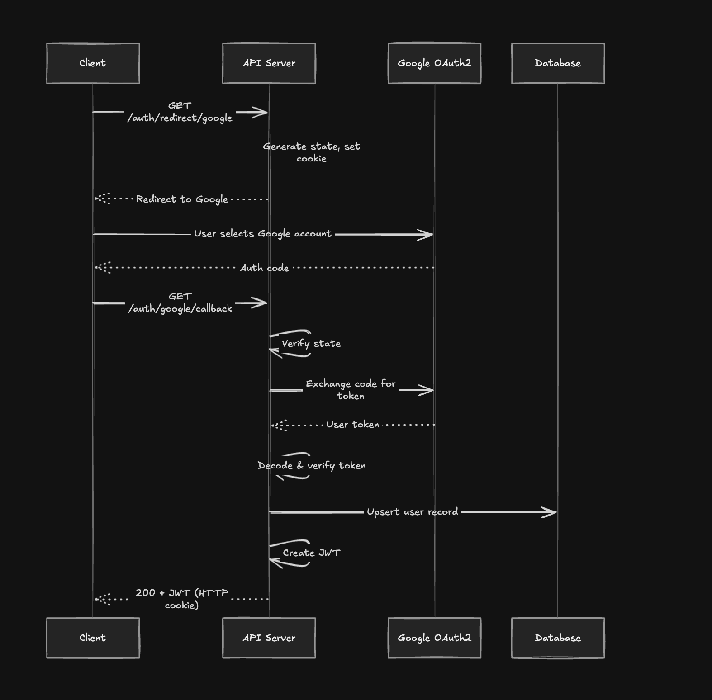
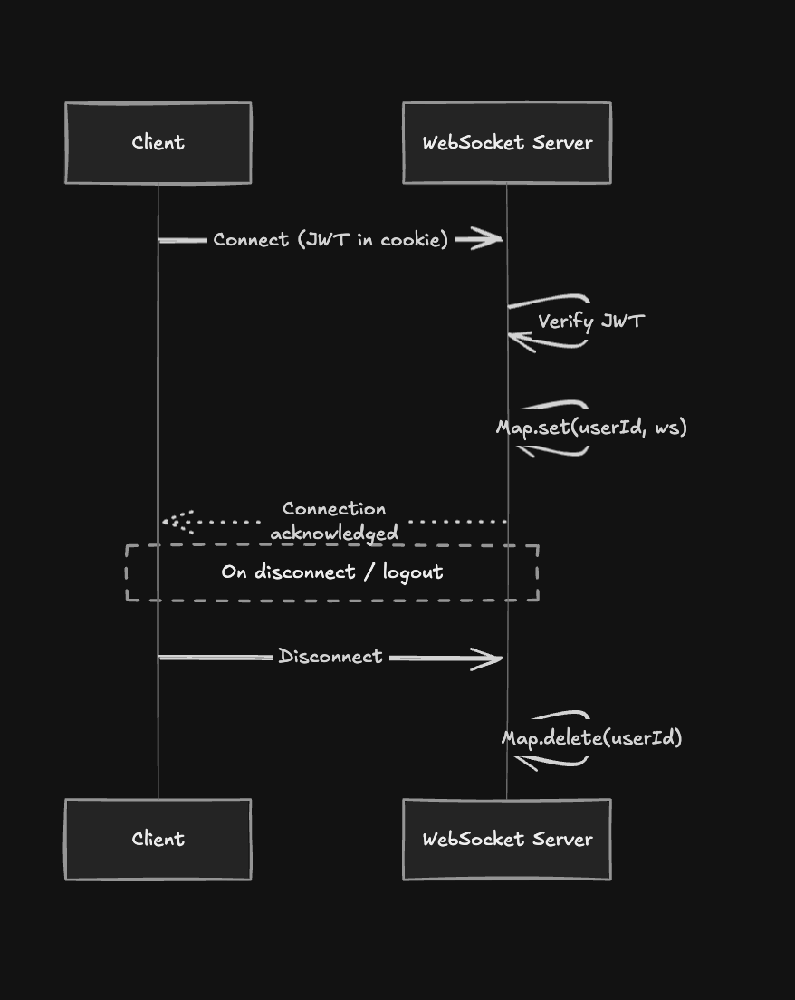
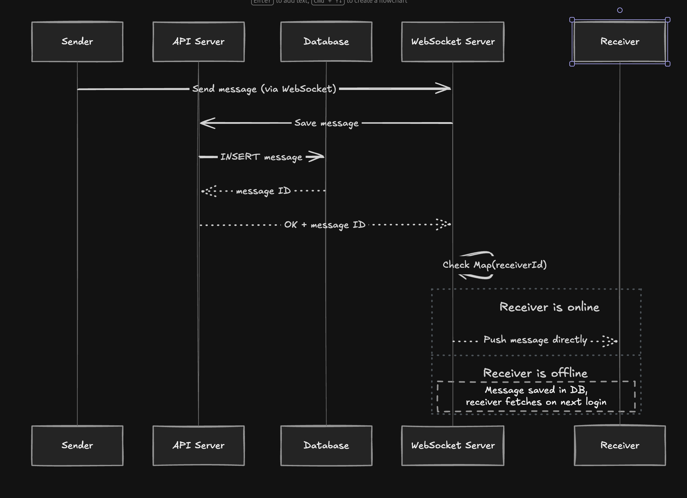
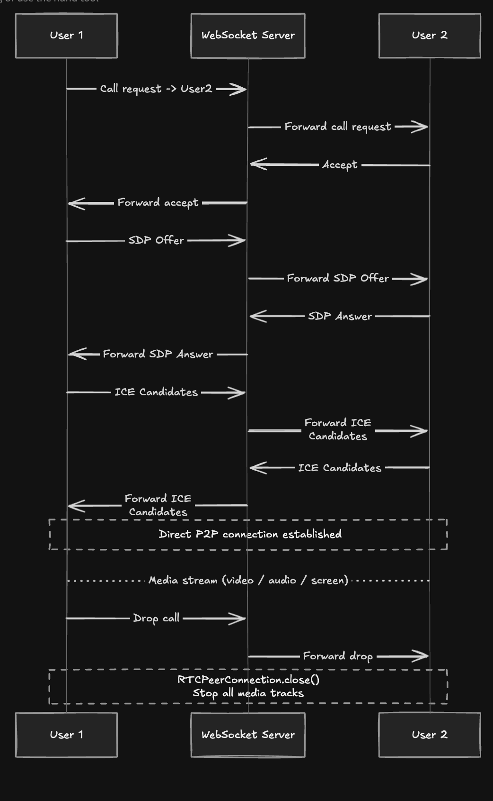
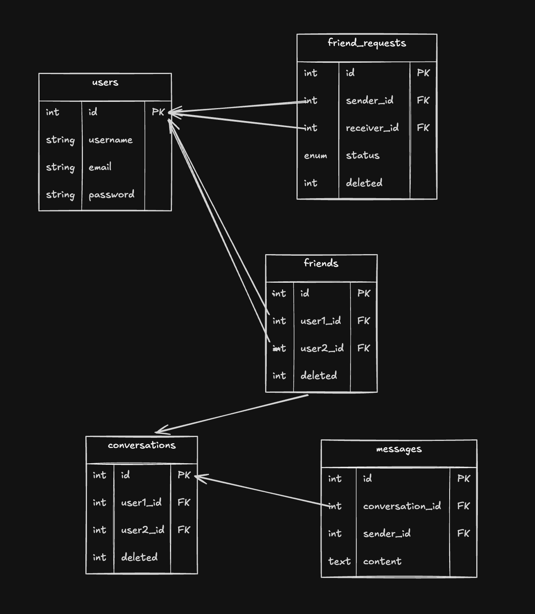

## Waves 

Peer-to-peer web video chat app

## Table of Contents

1. [System Overview](#1-system-overview)
2. [High-Level Architecture](#2-high-level-architecture)
3. [Core Components](#3-core-components)
4. [Data Flow](#4-data-flow)
   - 4.1 [Authentication Flow](#41-authentication-flow)
   - 4.2 [WebSocket Connection Flow](#42-websocket-connection-flow)
   - 4.3 [Messaging Flow](#43-messaging-flow)
   - 4.4 [Video Call Flow (WebRTC P2P)](#44-video-call-flow-webrtc-p2p)
5. [Database Design](#5-database-design)
6. [Key Design Decisions](#6-key-design-decisions)

## 1. System Overview

**live & usage:**

you can access this project via a custom domain: **https://waves.cam**
the `.cam` domain is used since the `.com` variant is already occupied.

- allow **camera and microphone permissions** when prompted
- ensure your browser supports modern WebRTC features
- use a modern browser (Chrome, Safari, Firefox, etc.) for best experience

**features:**

A real-time communication platform supporting:

- User authentication (email/password + Google OAuth2)
- Friend management (search, request, accept, reject, unfriend)
- Persistent 1:1 messaging via WebSocket + DB
- P2P video/audio calls via WebRTC
- Screen sharing and media recording

## 2. High-Level Architecture



## 3. Core Components

### 3.1 REST API Server

Handles all stateless operations:

- **Auth**: signup, login, Google OAuth2 callback, JWT issuance
- **Friend management**: search users, send/accept/reject/unfriend
- **Conversations**: fetch message history, persist new messages

### 3.2 WebSocket Server

Maintains a live registry of authenticated connections:

```
Map<UserId, WebSocket>
```

Used for:

- Real-time message delivery
- WebRTC call signaling (offer / answer / ICE candidates)
- Call control events (ring, accept, reject, drop)

### 3.3 WebRTC Engine (Client-side)

Handles all media directly between peers:

- **RTCPeerConnection** for video/audio
- **Separate RTCPeerConnection** for screen sharing (if concurrent)
- **RTCDataChannel** for in-call chat (no DB writes)
- Signaling is relayed through the WebSocket server

### 3.4 Database

Persistent store for users, relationships, and message history. Video calls produce **no DB writes**.

### 3.5 Google OAuth2 (External)

Third-party identity provider. Backend validates the token returned by Google and issues its own JWT.

## 4. Data Flow

### 4.1 Authentication Flow

#### Email / Password



#### Google OAuth2



### 4.2 WebSocket Connection Flow



### 4.3 Messaging Flow



### 4.4 Video Call Flow (WebRTC P2P)



## 5. Database Design



**Key relationships:**

- Accepting a friend request atomically creates both a `friends` row and a `conversations` row (transactional)
- Each conversation is strictly 1:1 (two users)
- Messages reference conversation, not individual users directly
- Video call data is **never persisted** — all in-memory, session-scoped

---

## 6. Key Design Decisions

| Decision            | Choice                     | Reason                                                     |
| ------------------- | -------------------------- | ---------------------------------------------------------- |
| Auth mechanism      | JWT in HTTP cookie         | Stateless, works across REST and WS handshake              |
| Real-time transport | WebSocket                  | Persistent, low-overhead, bidirectional                    |
| Video/audio         | WebRTC P2P                 | No media relay server needed; lower latency                |
| Call signaling      | WebSocket server           | Already established; no extra infrastructure               |
| In-call chat        | RTCDataChannel             | No DB writes; ephemeral, zero latency                      |
| Friend accept       | DB transaction             | Atomically creates `friends` + `conversations` rows        |
| Offline messages    | DB fallback                | Message persisted to DB; receiver fetches on reconnect     |
| Screen share        | Separate RTCPeerConnection | Keeps media tracks isolated and independently controllable |

**getting started:**

1. install bun (https://bun.sh/)
2. run `bun install`
3. start dev server: `bun run dev`
4. visit http://localhost:3000/

to build browser bundle:
`bun run build:browser`

**tech stack:**

- typescript
- bun runtime
- native web apis: [WebRTC](https://developer.mozilla.org/en-US/docs/Web/API/WebRTC_API), [WebSocket](https://developer.mozilla.org/en-US/docs/Web/API/WebSockets_API), [DOM](https://developer.mozilla.org/en-US/docs/Web/API/Document_Object_Model), [CSS](https://developer.mozilla.org/en-US/docs/Web/CSS)
